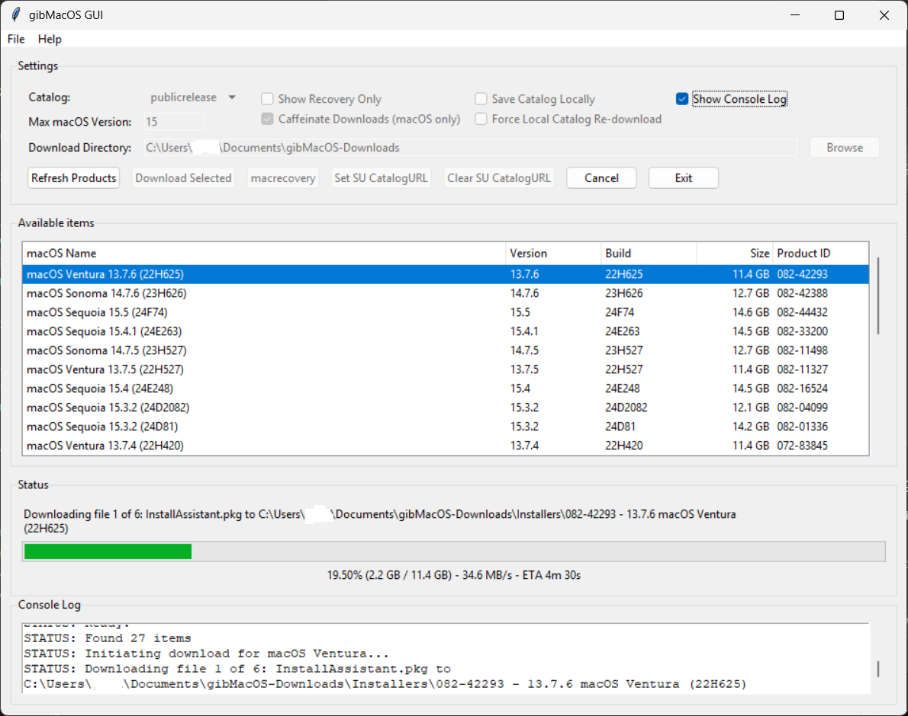
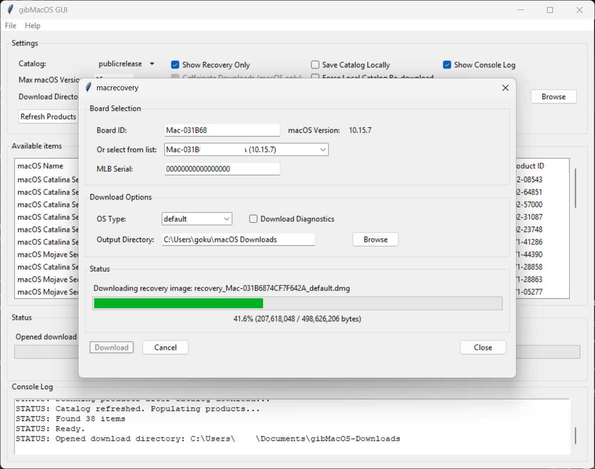

# 🚀 gibMacOS GUI

[](https://www.python.org/downloads/)
[](https://opensource.org/licenses/MIT)

A modern, user-friendly GUI for downloading macOS installers and recovery images. Based on the original gibMacOS by corpnewt.

**Repo:** [https://github.com/HelllGuest/gibMacOS_GUI](https://github.com/HelllGuest/gibMacOS_GUI)  
**Original gibMacOS by corpnewt:** [https://github.com/corpnewt/gibMacOS](https://github.com/corpnewt/gibMacOS)  
**macrecovery.py by acidanthera team:** [https://github.com/acidanthera/OpenCorePkg](https://github.com/acidanthera/OpenCorePkg)  
**GUI Author:** Anoop Kumar  
**License:** MIT

---

## 🎯 Quick Highlights

- **🐍 Python 3.7+ Compatible**: Works across all modern Python versions
- **📱 Cross-Platform**: Windows, macOS, and Linux support

## ✨ Features

- Download full macOS installers and recovery images directly from Apple
- Clean, cross-platform graphical interface with modern design
- Advanced file verification and integrity checks (Apple chunklist format)
- Real-time progress tracking with detailed status updates
- Hardware-specific downloads for the macosrecovey (Board ID support)
- Session management and robust error handling
- **Enhanced Security**: Secure file operations with proper subprocess handling
- **Python 3.7+ Compatible**: Works across all modern Python versions

## 🖼️ Screenshots

<details>
<summary><strong>📸 Click to show/hide screenshots</strong></summary>

### Main Window



### macrecovery



</details>


## 🗂️ Project Structure

```text
gibMacOS_GUI/
├── LICENSE
├── README.md
├── requirements.txt
├── run_gui.py
├── pyproject.toml      # Python project configuration
├── src/
│   ├── backend/        # Core backend logic: macOS downloads, recovery, exceptions, board info
│   │   ├── __init__.py
│   │   ├── boards.json
│   │   ├── exceptions.py
│   │   ├── gibmacos_backend.py
│   │   └── internet_recovery.py
│   ├── gui/            # All GUI dialogs and main interface
│   │   ├── __init__.py
│   │   ├── dialogs.py
│   │   ├── gibmacos_gui.py
│   │   └── internet_recovery_dialog.py
│   ├── utils/          # Utility functions and file verification
│   │   ├── __init__.py
│   │   ├── file_verification.py
│   │   └── helpers.py
│   ├── downloader.py   # Enhanced download logic with retry mechanisms
│   └── main.py         # Main application entry point
```

> **Note:**
>
> - The `gibMacOS/` directory and `screenshots/` are not part of this repository. `gibMacOS` will be downloaded as needed; screenshots can be added later.
> - All GUI dialogs are included and maintained.

## 🛠️ Installation

This project uses [PEP 621](https://peps.python.org/pep-0621/) and [pyproject.toml](https://packaging.python.org/en/latest/specifications/pyproject-toml/) for modern Python packaging and dependency management.

### Quick Start

1. **Clone the repository:**

   ```sh
   git clone https://github.com/HelllGuest/gibMacOS_GUI.git
   cd gibMacOS_GUI
   ```

2. **(Recommended) Create a virtual environment:**

   ```sh
   python -m venv .venv
   source .venv/bin/activate  # On Windows: .venv\Scripts\activate
   ```

3. **Install dependencies:**

   ```sh
   pip install .
   ```

Alternatively, you can use `requirements.txt` for legacy compatibility:

```sh
pip install -r requirements.txt
```

## 🖥️ Usage

### Launch the GUI

```sh
python run_gui.py
```

#### What's the difference between running main.py directly and running run_gui.py?

- **run_gui.py** is the recommended entry point for most users. It sets up the environment, ensures dependencies and paths are correct, and then launches the GUI. This script is designed to work out-of-the-box and is the most robust way to start the application.
- **src/main.py** is the core application entry point. Running it directly (e.g., `python src/main.py`) will also launch the GUI, but it assumes the environment and paths are already set up correctly. This is mainly for development or advanced users who know the project structure and want to bypass the extra setup logic in `run_gui.py`.

In summary: **Use `run_gui.py` unless you have a specific reason to run `main.py` directly.**

### Clean Up Unrelated Files

To remove all files and folders created during the running of this project (such as downloads, cache, logs, temp, venv, __pycache__, etc.), run:

```sh
python run_gui.py --cleanup
```

This will delete the following if present in the project root **and will recursively remove all `__pycache__` folders from all subdirectories**:

- Folders: `gibMacOS`, `screenshots`, `downloads`, `catalog_cache`, `logs`, `temp`, `tmp`, `.pytest_cache`, `.mypy_cache`, `.tox`, `.nox`, `.vscode`, `.idea`, `__pycache__`, `.venv`
- Files matching: `HOW_TO_USE.md`, `*.log`, `*.tmp`, `*.bak`, `*.old`, `*.sqlite`, `*.sqlite3`, `*.db`, `*.egg-info`, `*.pyc`, `*.pyo`, `*.swp`, `*.swo`, `*~`, `settings.json`, `config.json`

All these are considered temporary or unrelated to the core project and are safe to remove. A summary of what was removed will be printed.

### Main Interface

1. **Launch the Application**

   - Run `python run_gui.py` or `python src/main.py`
   - The main window will display available macOS versions

2. **Download macOS Installers**

   - Select a macOS version from the list
   - Click "Download Selected" to start the download
   - Monitor progress in the status bar

3. **macrecovery Recovery Downloads**

   - Click "macrecovery Download" button
   - Select a Mac board ID from the dropdown or enter manually
   - Choose OS type (default/latest) and options
   - Click "Download" to start

> **⚠️ Note:**
> After applying any filter (such as changing catalog, version, or toggling "Show Recovery Only"), the product selection will be cleared and the download button will be disabled. You must select a product from the refreshed list to enable the download button again.

### macrecovery Recovery Features

- **Dropdown List**: Choose from comprehensive list of Mac board IDs
- **Manual Entry**: Enter board ID manually if not in list
- **Version Display**: Shows macOS version for selected board
- **OS Type**: Choose "default" or "latest" recovery image
- **Diagnostics**: Toggle to download diagnostic tools
- **Output Directory**: Select custom download location
- **Progress Tracking**: Visual progress bar, status messages, file info

### File Verification

- **Chunklist Verification**: Apple's proprietary format support
- **Digital Signatures**: RSA signature validation
- **Hash Verification**: SHA256 hash checking
- **File Integrity**: Complete file integrity validation

## ⚙️ Configuration

- **Download Directory**: Default is `Documents/gibMacOS-Downloads` with organized subdirectories:
  - `Installers/`: For full macOS installer packages (automatically sorted by version)
  - `Recovery/`: For recovery image files (automatically used when downloading recovery images)
  - `Diagnostics/`: For diagnostic tools and utilities (automatically used for diagnostic downloads)
- **Network Settings**: 60s timeout, 5 retries, Apple-compatible user agent
- **Security**: All file operations use secure subprocess calls with proper argument escaping

## 🐛 Troubleshooting

### Common Issues

#### Python Version Error

```text
Error: Python 3.7+ required
```

**Solution**: Install Python 3.7 or higher

#### Tkinter Not Available

```text
Error: Tkinter not available
```

**Solution**:

- **Windows**: Install Python with Tkinter option
- **Linux**: `sudo apt-get install python3-tk`
- **macOS**: Usually included with Python

#### Network Connection Issues

```text
Error: Connection failed
```

**Solutions**:

- Check internet connection
- Disable firewall/antivirus temporarily
- Use VPN if region-blocked
- Try different network

#### Download Failures

```text
Error: Download failed
```

**Solutions**:

- Check available disk space
- Verify write permissions
- Try different download directory
- Check network stability

#### Import Errors

```text
Error: Module not found
```

**Solution**: Run `pip install -r requirements.txt`

### HTTP 403 Error When Downloading Recovery Image

If you see an error like:

```text
Download failed:
Failed to download recovery image: HTTP error 403 when connecting to http://osrecovery.apple.com/InstallationPayload/Diagnostics:
```

This means Apple's server is refusing access to the requested resource. Possible reasons include:

- **Apple server restrictions:** Requests may be blocked if not coming from real Mac hardware or missing required headers/tokens.
- **Invalid or expired session:** The download process may require a valid session or authentication token.
- **Incorrect or unsupported Board ID / MLB:** Using an unrecognized or unsupported Mac board ID or MLB value.
- **Rate limiting or IP blocking:** Too many requests in a short period, or requests from suspicious IPs, may be blocked.
- **Outdated or incorrect User-Agent:** Apple may block requests with generic or missing user-agent headers.
- **Region or network restrictions:** Some Apple services are region-locked or block VPN/proxy/cloud server requests.
- **URL or resource no longer available:** The requested resource may have been moved or removed by Apple.

**How to troubleshoot:**

1. Check that you are using a valid, supported Mac board ID and MLB value.
2. Ensure your tool is correctly obtaining and using any required session tokens or cookies.
3. Use a realistic Mac user-agent string in your requests.
4. Try a different network or disable VPN/proxy.
5. Wait and retry if you have made many requests (rate limiting).
6. Verify the URL is correct and up to date.
7. Make sure you are using the latest version of the tool.

## 🙏 Credits & Acknowledgments

- **corpnewt**: [Original gibMacOS tool](https://github.com/corpnewt/gibMacOS)
- **acidanthera team**: [macrecovery.py](https://github.com/acidanthera/OpenCorePkg)
- **vit9696**: [macrecovery functionality](https://github.com/acidanthera/OpenCorePkg/blob/master/Utilities/macrecovery/macrecovery.py)
- **Anoop Kumar**: [GUI wrapper and integration](https://github.com/HelllGuest/gibMacOS_GUI)

---

**This project is licensed under the MIT License. See the [LICENSE](LICENSE) file for details.**

**This tool is for educational and legitimate use only. Please respect Apple's terms of service and only download software you are entitled to use.**

## 🧩 Compatibility

### Python Version

- **Recommended:** Python 3.7 or higher
- **Minimum:** Python 3.7 (required for all features)
- **Tested:** Python 3.7, 3.8, 3.9, 3.10, 3.11, 3.12
- **Why:**

  - The project uses f-strings (Python 3.6+), pathlib, and subprocess.run with capture_output (Python 3.7+).
  - Type annotations use typing module for Python 3.7+ compatibility.
  - Some dependencies (like recent pyobjc) require Python 3.7+.
  - Python 3.6 is end-of-life and not recommended for new projects.

### Operating System

- **Windows:** Fully supported (ensure Tkinter is included in your Python install)
- **macOS:** Fully supported (pyobjc and caffeinate features enabled)
- **Linux:** Supported (install Tkinter with `sudo apt-get install python3-tk`)

### Potential Issues with Older Python Versions

- **Python 3.6:**

  - `subprocess.run(..., capture_output=True)` will fail (not available until 3.7)
  - Some dependencies may not install or work as expected
  - You may see syntax errors or missing features

- **Python 3.5 and below:**

  - The project will not run due to missing language features and modules

### What if you want to run on an older Python version?

- **Not recommended.**
- You would need to:

  - Replace all f-strings with `.format()` or `%` formatting
  - Replace `subprocess.run(..., capture_output=True)` with `stdout=subprocess.PIPE, stderr=subprocess.PIPE`
  - Test all dependencies for compatibility
  - Update any code using features introduced after your Python version

- **Best solution:** Upgrade your Python to 3.7 or higher for full compatibility and security.

### Summary Table

| Feature/Module         | Python 3.6 | Python 3.7+ | Windows | macOS | Linux |
|-----------------------|:----------:|:-----------:|:-------:|:-----:|:-----:|
| f-strings             |     ✔️     |     ✔️      |   ✔️    |  ✔️   |  ✔️   |
| pathlib               |     ✔️     |     ✔️      |   ✔️    |  ✔️   |  ✔️   |
| subprocess.run (capture_output) | ❌ | ✔️ | ✔️ | ✔️ | ✔️ |
| typing.Optional       |     ❌     |     ✔️      |   ✔️    |  ✔️   |  ✔️   |
| tkinter               |     ✔️     |     ✔️      |   ✔️    |  ✔️   |  ✔️*  |
| pyobjc                |     ❌     |     ✔️      |   ❌    |  ✔️   |  ❌   |
| requests              |     ✔️     |     ✔️      |   ✔️    |  ✔️   |  ✔️   |

\* On Linux, user must install `python3-tk`.
